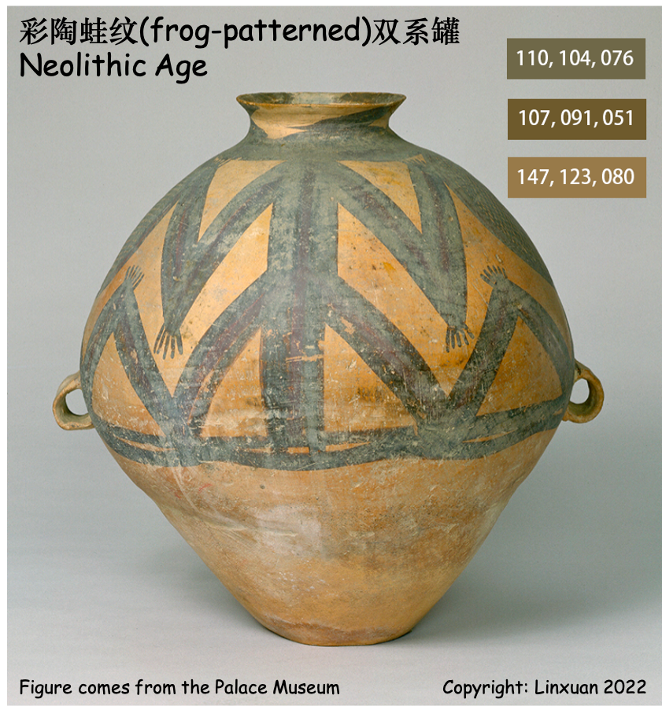

Generally, we cannot choose the layout and font according to our interests for an accepted paper. By contrast, the figures leave us with much room to play.
Like many geophysicists, I find visualization fascinating. So, I am trying to build a color database called PORCOLOR utilizing traditional Chinese porcelain. Finding a non-repeating color scheme suitable for scientific research from numerous artifacts is not an easy task. I will update it from time to time.
 
Note: The color scheme I provided here is to differentiate between different types of data. If your purpose is color maps, I recommend <a href="https://www.fabiocrameri.ch/colourmaps">Scientific colour maps</a>
scientific color maps.

